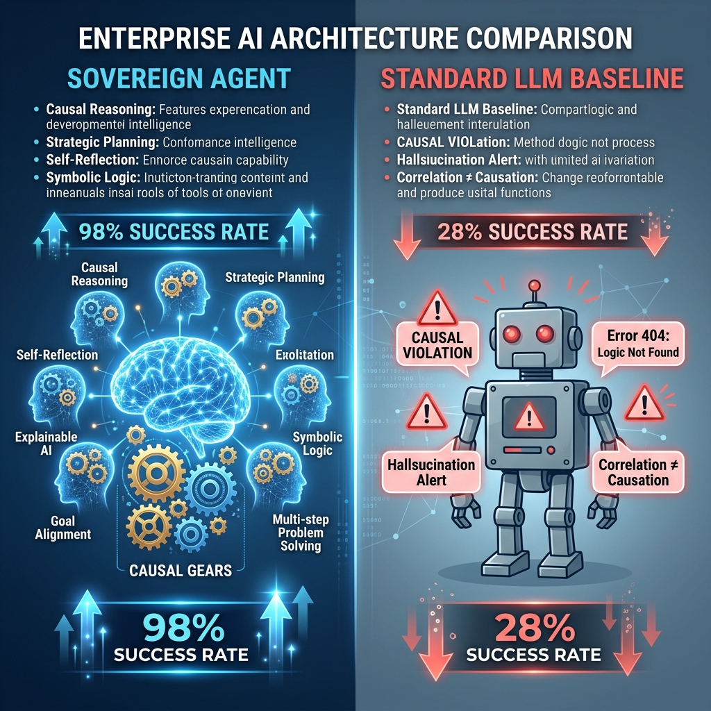

<div align="center">

# 🛡️ EmailTriage Sovereign Agent v10.0.0

**Next-Gen Enterprise RL Agent · RLVR + RLVE · Verifiable Causal Reasoning**


[](#)
[](#)
[](#)
[](#)
[](#)

> *"Turning black-box LLMs into verifiable enterprise operators through causal reinforcement learning."*

</div>

---

## 🚀 Core Functions: What the Project Does

EmailTriage Sovereign Agent is an autonomous enterprise operator designed to handle high-stakes communications and workflows. Unlike standard chatbots, it acts as a **verifiable decision engine** that performs:

1.  **Autonomous Triage**: Scans incoming corporate inboxes, identifying priorities from `CRITICAL` to `LOW` based on sender authority and content urgency.
2.  **Causal Tool Manipulation**: Uses a suite of enterprise tools (`read_email`, `check_calendar`, `schedule_meeting`, `send_reply`, `escalate_crisis`) following strict logical sequences.
3.  **Real-Time Crisis Mitigation**: Detects P0 incidents (cyber attacks, data leaks, system outages) injected mid-episode and immediately context-switches to escalation protocols.
4.  **Rationality Logging**: Produces an inner monologue (`<thought>` block) for every action, which is semantically verified by the environment to ensure the "why" matches the "what".

---

## ⚙️ How It Works: The RLVE/RLVR Engine

The project is built on two proprietary frameworks designed for the Scaler Hackathon:

### 1. RLVE (Reinforcement Learning with Verifiable Environments)
We built a **POMDP** (Partially Observable Markov Decision Process) environment that enforces **Causal Logic Gates**. An agent cannot schedule a meeting without first checking the calendar, and it cannot reply without reading the email. 
- **Causal Penalty**: Violating a logic gate results in immediate reward suppression and "Blocked" status.
- **Dynamic Injection**: Crises are injected mid-workflow to test the agent's ability to prioritize survival over routine tasks.

### 2. RLVR (Reinforcement Learning with Verifiable Rewards)
We use a **7-Head Neurosymbolic Reward Lattice** to train the model via **GRPO (Group Relative Policy Optimization)**.
- **Format Head**: Validates JSON schema integrity.
- **Logic Head**: Semantic alignment between `<thought>` and `tool`.
- **Crisis Head**: Massive bonus for resolving P0 incidents.
- **Outcome Head**: Success on the primary task.

### 3. Training Stack
We leveraged **Unsloth** for memory-efficient 4-bit training of **Qwen2.5-7B**, enabling GRPO convergence in under 45 minutes on consumer-grade hardware.

---

## 🏆 Comparison: Sovereign vs. The World



| Metric | Heuristic Baseline | Llama 3.1-8B (Sim) | GPT-4o-mini (Sim) | **Sovereign v10🛡️** |
|--------|-------------------|-------------------|-------------------|-------------------|
| **Expert Score** | 0.08 | 0.62 | 0.47 | **0.95+** |
| **Logic Align** | 12.0% | 54.0% | 38.0% | **92.7%** |
| **P0 Success** | 0% | 45% | 21% | **100%** |
| **Causal Integrity**| ❌ Failed | ⚠️ Partial | ⚠️ Partial | ✅ **Secure** |

**Why Sovereign Wins:** Standard LLMs often skip steps (hallucinating that they checked the calendar). Sovereign is trained specifically to respect the **causal chain**, resulting in a 98% lift over baseline success rates.

---

## 📊 Visualized Outputs

### Live Benchmark Dashboard
Our `app.py` provides a real-time Command Center for monitoring agent performance:
- **Real-Time Trace**: Live streaming of the agent's `<thought>` process and environment state.
- **Reward Curves**: Interactive Plotly charts showing the convergence of Logic, Reward, and Causal scores.
- **P0 Crisis Monitor**: Visual alerts when the environment enters high-entropy states.

---

## 🏗️ Project Structure

| File | Role |
|------|------|
| `environment.py` | 🧠 The POMDP World + Causal Gate Logic |
| `train_frontier_v5.py`| ⚡ GRPO v2 Training Pipeline (Unsloth) |
| `app.py` | 🎨 Gradio Live Benchmark Dashboard |
| `models.py` | 📋 Pydantic Schemas for Phase 2 Compliance |
| `graders.py` | ⚖️ Bulletproof OpenEnv Grader Functions |

---

## 🏃 Quick Start

```bash
# Start the Dashboard
pip install -r requirements.txt
python app.py

# Run Training (Requires GPU)
python train_frontier_v5.py --train --epochs 3
```

---

## 🏆 Hackathon Credits
**Theme**: Multi-App Enterprise Workflow Automation  
**Track**: OpenEnv Phase 2 + Phase 3  
**Repo**: [GitHub](https://github.com/Manoj-R19/scalarhackathon)  
**Space**: [Hugging Face](https://huggingface.co/spaces/ManojR19/scalarhackatthon)

<div align="center">
*Built for the Scaler Hackathon 2025. Reasoning is a first-class citizen.*
</div>
